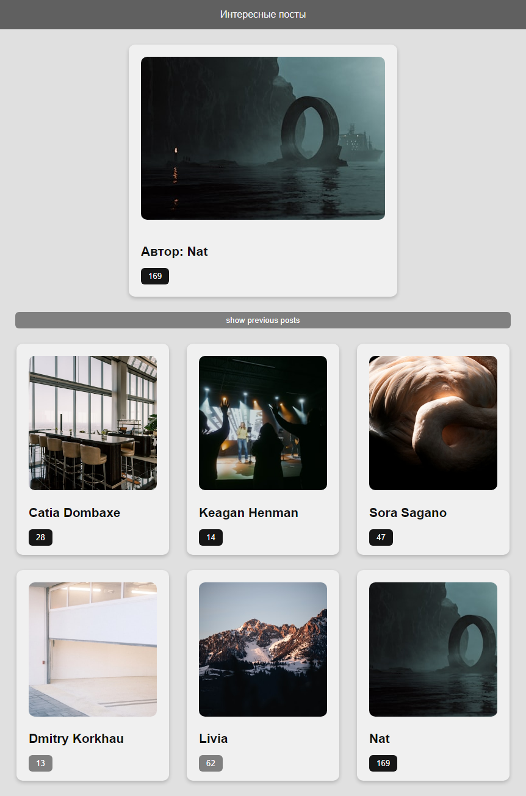

# [Главная страница галереи](https:// "Ссылка на сайт")

## Описание проекта

Этот проект представляет собой интерактивную галерею изображений, которая динамически загружает случайное изображение с помощью API Unsplash. Пользователи могут лайкать изображения и просматривать историю просмотренных постов, количество лайков сохраняется в localStorage и отображается на странице.

   Технологии: HTML, CSS, JavaScript, Fetch API, Unsplash API.

   Основные функции:

   * Динамическая загрузка изображений: При загрузке страницы автоматически загружается случайное изображение с помощью API Unsplash.
   * Интерактивность: Пользователи могут лайкать изображения, кликая на кнопку like. Пользователи могут как добавлять, так и удалять лайки. 
   * Сохранение данных: Все лайки сохраняются в localStorage, что позволяет сохранять информацию о лайках даже после перезагрузки страницы.
   * История просмотров: Пользователи могут просматривать историю просмотренных изображений, нажав на кнопку history.
   * Адаптивный макет.

Этот проект демонстрирует мои навыки в области веб-разработки, включая работу с API, асинхронное программирование. Код проекта написан на чистом JavaScript, с использованием API Unsplash для загрузки изображений и localStorage для сохранения данных.

## Скриншоты сайта

Здесь представлены два скриншота сайта:

1. Скриншот десктопной версии сайта
 

2. Скриншот мобильной версии сайта

